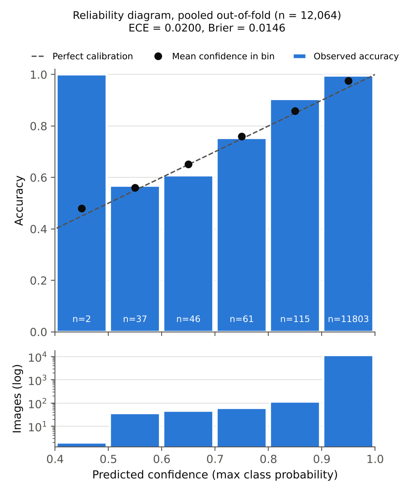

# Final five-fold cross-validation results (audited)

Inputs: the five `fold_k_predictions.csv` files (final code: MC-Dropout T = 20, p = 0.20; 10-way TTA; seed 42).
Reproduce with:
```
python3 tools/final_cv_summary.py reviews/figures fold_1_predictions.csv fold_2_predictions.csv fold_3_predictions.csv fold_4_predictions.csv fold_5_predictions.csv
```
Every per-fold value was recomputed from the per-image predictions and matches the saved `fold_k_metrics.json` exactly. Differences are ≤ 1e-12.

## 1. Integrity: PASS
- The five test folds are pairwise disjoint (0 shared paths in all 10 pairs). Their union is **exactly 12,064 images**, so every image is predicted once, by the one model that never trained on it. ✅
- Every probability row sums to 1, every prediction equals the argmax, labels match their folders, and the confusion matrices match the CSVs and PNGs. ✅
- The class totals are **glioma 3,773, meningioma 2,729, no tumour 2,432, pituitary 3,130**. Use these in Section 3.1.

## 2. Main results table (for the paper)

| Fold | n | Accuracy | Macro precision | Macro recall | Macro F1 | ECE | Brier | NLL |
|---|---|---|---|---|---|---|---|---|
| 1 | 2413 | 0.9930 | 0.9926 | 0.9938 | 0.9932 | 0.0187 | 0.0132 | 0.0460 |
| 2 | 2413 | 0.9925 | 0.9928 | 0.9923 | 0.9925 | 0.0190 | 0.0121 | 0.0434 |
| 3 | 2413 | 0.9925 | 0.9928 | 0.9923 | 0.9925 | 0.0188 | 0.0132 | 0.0467 |
| 4 | 2413 | 0.9946 | 0.9946 | 0.9946 | 0.9946 | 0.0231 | 0.0091 | 0.0406 |
| 5 | 2412 | 0.9847 | 0.9840 | 0.9849 | 0.9844 | 0.0248 | 0.0256 | 0.0696 |
| **Mean ± SD** | | **0.9915 ± 0.0039** | **0.9914 ± 0.0042** | **0.9916 ± 0.0039** | **0.9915 ± 0.0040** | **0.0209 ± 0.0029** | **0.0147 ± 0.0064** | **0.0493 ± 0.0116** |

SD is the sample standard deviation (ddof = 1). In percent: **accuracy 99.15 ± 0.39%, macro-F1 99.15 ± 0.40%.**

### Pooled out-of-fold (OOF), n = 12,064

| Metric | Value | 95% bootstrap CI (image-level) | 95% bootstrap CI (cluster-level\*) |
|---|---|---|---|
| Accuracy | **0.9915** (11,961/12,064) | [0.9899, 0.9931] | [0.9897, 0.9932] |
| Macro F1 | **0.9915** | [0.9898, 0.9931] | [0.9897, 0.9932] |
| Macro precision / recall | 0.9913 / 0.9916 | – | – |
| ECE (10 bins, top-label) | 0.0200 | [0.0193, 0.0217] | [0.0192, 0.0218] |
| Brier (sum over classes) | 0.0146 | [0.0121, 0.0170] | [0.0121, 0.0173] |
| NLL | 0.0493 | – | – |

\* Cluster-level means all augmented copies of one slice are resampled together (8,438 clusters). B = 2,000, seed 42. The two kinds of CI are almost identical, so sibling correlation barely changes the uncertainty estimate.

### Per-class (pooled OOF)

| Class | Support | Precision | Recall (sensitivity) | Specificity | F1 |
|---|---|---|---|---|---|
| Glioma | 3,773 | 0.9933 | 0.9897 | 0.9970 | 0.9915 |
| Meningioma | 2,729 | 0.9890 | 0.9853 | 0.9968 | 0.9872 |
| No tumour | 2,432 | 0.9922 | 0.9955 | 0.9980 | 0.9938 |
| Pituitary | 3,130 | 0.9908 | 0.9958 | 0.9968 | 0.9933 |

### Pooled OOF confusion matrix (rows = true, columns = predicted)

| | Glioma | Meningioma | No tumour | Pituitary |
|---|---|---|---|---|
| **Glioma** | **3734** | 23 | 10 | 6 |
| **Meningioma** | 20 | **2689** | 5 | 15 |
| **No tumour** | 3 | 0 | **2421** | 8 |
| **Pituitary** | 2 | 7 | 4 | **3117** |

- 103 errors in total.
- glioma ↔ meningioma: 43 errors (42%). meningioma ↔ pituitary: 22. glioma ↔ pituitary: 8.
- Tumour → "no tumour" (missed tumour): 19, i.e. 0.20% of the 9,632 tumour images.
- No tumour → tumour (false alarm): 11, i.e. 0.45% of the 2,432 no-tumour images.

Use this matrix as the paper's confusion-matrix figure, replacing any single-fold matrix.

## 3. Fold 5 is weaker. Investigate it, but do not "fix" it by rerunning

| | Folds 1–4 | Fold 5 |
|---|---|---|
| Accuracy | 99.25–99.46% | **98.47%** |
| Errors | 13–18 | **37** |
| Predictions with confidence < 0.9 | 19–40 | **140** |
| Mean confidence | 0.973–0.977 | **0.960** |
| Error rate, images from original `Train/` folder | 0.57–0.87% | **1.64%** |
| Error rate, images from original `Test/` folder | 0.21–0.43% | **1.14%** |

- The errors rise in **every** data source (`Tr-` files 15, numbered files 13, others 9) and in both original folders.
- The predicted class distribution is normal (746 / 541 / 492 / 633), so there is no class collapse.
- This points to a **weaker trained model in Fold 5**, not a harder test fold. The likely causes are early stopping at a less mature epoch, or a different training trajectory on that run's GPU.
- Fold 5 does contain more images from the original `Test/` folder (525 vs 469–477). Those images have *lower* error rates in every fold, so this cannot explain the drop.

What to do:
1. **Send the Fold 5 training log**: epoch of the best checkpoint, total epochs run, validation-accuracy curve, GPU type and runtime. Compare it with Fold 4's log.
2. **Do not rerun Fold 5 just to get a better number.** That is selective reporting, and reviewers increasingly ask about it. Rerun only if the log shows a genuine fault, such as a runtime cut-off, a crash and resume, or the wrong code version. If you rerun, say so in the paper and give the reason.
3. If there is no fault, report Fold 5 as it is. A fold-to-fold range of 98.47–99.46% is an honest, believable result. It also supports the sentence *"performance was stable across four folds; one fold showed lower confidence and accuracy, indicating sensitivity to the training trajectory."*

## 4. Leakage: final quantification

- **Augmented copies:** 620 source slices appear as 4,246 images (35.2% of the dataset). **591 of them have exactly 7 copies** (the original plus RO, VF, HF, BR, SP, DA).
- **Confirmed in training:** for 99.6–99.9% of these test images per fold, at least one copy of the same slice sits in that fold's training data.
- **Effect on accuracy:** leaked images 4,202/4,238 = **99.15%** vs the rest 7,759/7,826 = **99.14%**. No measurable difference.
- **Remaining unknown:** the dataset authors' de-duplicated Version 7 keeps 5,941 images. Our filename grouping only collapses the dataset to 8,438 clusters, so roughly 2,500 further near-duplicates (mostly across the public sources) are not visible from filenames. pHash would be needed to find them.

Suggested wording for the paper:
> "File-name analysis revealed that 4,246 images (35.2%) are offline-augmented copies of 620 source slices (typically seven variants each), so image-level folds place copies of the same slice in both training and test partitions. Accuracy on test images with a confirmed copy in the training partition (99.15%) did not differ from that on the remaining images (99.14%). Nevertheless, because further near-duplicates across source collections cannot be excluded, the reported figures should be interpreted as image-level estimates, and duplicate-aware (grouped) validation is reported in Section X / identified as future work."

## 5. Calibration



| Confidence bin | n | Accuracy | Mean confidence |
|---|---|---|---|
| (0.4, 0.5] | 2 | 1.000 | 0.480 |
| (0.5, 0.6] | 37 | 0.568 | 0.560 |
| (0.6, 0.7] | 46 | 0.609 | 0.651 |
| (0.7, 0.8] | 61 | 0.754 | 0.759 |
| (0.8, 0.9] | 115 | 0.904 | 0.859 |
| (0.9, 1.0] | 11,803 | **0.9964** | **0.9766** |

- Below 0.9 confidence the model is well calibrated: accuracy follows confidence closely.
- **97.8% of images sit in the top bin**, where accuracy is 99.6% but confidence averages only 97.7%. The highest output anywhere is 0.988, because label smoothing (ε = 0.03) caps the target at 0.9775. **The ECE of 0.020 is therefore almost entirely mild under-confidence caused by label smoothing.** It is not over-confidence, and it does not show anything about the uncertainty gate.
- 29 of the 103 errors (28%) were made at confidence ≥ 0.95. Confidence is useful for ranking predictions, but it does not reliably flag errors.
- Suggested paper sentence:
  > "The model was slightly under-confident (ECE = 0.020), consistent with the confidence ceiling imposed by label smoothing; predictions below 0.9 confidence were well calibrated, while 28% of errors occurred at confidence ≥ 0.95."
- Optional: temperature scaling fitted on each fold's validation split would likely bring ECE close to zero. Report it as a post-hoc result if you add it.

## 6. Error rate by data source

| Filename family | n | Errors | Error rate |
|---|---|---|---|
| G/M/P/N_### (+ augmented copies) | 4,246 | 36 | 0.85% |
| Tr-xx_#### (Nickparvar-style, training) | 3,784 | 37 | 0.98% |
| #.jpg (plain numbered) | 1,914 | 6 | 0.31% |
| gg / m / p (n) (SARTAJ-style, training) | 935 | 6 | 0.64% |
| Te-xx_#### (Nickparvar-style, testing) | 858 | 2 | 0.23% |
| **image(n) (SARTAJ-style, testing)** | **249** | **15** | **6.02%** |
| no / N (Chakrabarty-style) | 76 | 1 | 1.32% |

- The `image(n)` family is about 2% of the data but contributes 15% of the errors, with an error rate seven times the average.
- Its errors are mostly gliomas predicted as meningioma or no tumour at about 0.97 confidence, consistent with label noise in that source.
- **Have these images reviewed by a radiologist** before writing the error-analysis paragraph. The full list of high-confidence errors is in `cv-results-running.md` and the output of `tools/cross_fold.py`.

## 7. Draft text for Results §5.1 (fill in after the Fold 5 log check)

> **5.1 Overall cross-validated performance.** Table X reports fold-wise and aggregate performance. Across the five held-out folds, the proposed framework achieved an accuracy of 99.15 ± 0.39% (mean ± SD), a macro-F1 of 99.15 ± 0.40%, an ECE of 0.021 ± 0.003 and a multiclass Brier score of 0.015 ± 0.006. Pooling the out-of-fold predictions of all 12,064 images, in which each image is predicted only by the model that did not see it during training, gives an accuracy of 99.15% (95% bootstrap CI 98.99–99.31%) and a macro-F1 of 99.15% (98.98–99.31%). Four folds yielded accuracies between 99.25% and 99.46%, whereas Fold 5 reached 98.47%. That fold showed uniformly lower confidence across all data sources rather than a concentration of errors in a particular subset, indicating sensitivity to the training trajectory. Class-wise sensitivity ranged from 98.53% (meningioma) to 99.58% (pituitary), with specificity ≥ 99.68% for every class (Table Y). Most residual errors involved the glioma–meningioma pair (43 of 103), and only 19 of 9,632 tumour images (0.20%) were classified as no tumour (Figure Z).

---

## সংক্ষেপে (বাংলা)

- ৫টা fold-এর সব সংখ্যা predictions থেকে আমি নিজে হিসাব করে মিলিয়েছি, **হুবহু মিলেছে।** ৫টা fold মিলে **ঠিক 12,064টা image, কোনো overlap নেই।**
- **চূড়ান্ত ফল:** Accuracy **99.15 ± 0.39%**, Macro-F1 **99.15 ± 0.40%**, ECE 0.021 ± 0.003, Brier 0.015 ± 0.006। সব image একসঙ্গে ধরলে (pooled OOF) 99.15%, 95% CI 98.99–99.31%।
- **Fold 5 দুর্বল (98.47%)।** সমস্যাটা data-তে না, model-এ (সব source-এ ভুল বেড়েছে, confidence কম)। Fold 5-এর training log পাঠাও। শুধু ভালো সংখ্যা পাওয়ার জন্য আবার চালানো ঠিক হবে না, log-এ সত্যিকারের কোনো সমস্যা পেলে তবেই আবার চালাবে আর সেটা paper-এ লিখবে।
- **Leakage:** dataset-এর 35% (4,246টা image) আসলে 620টা slice-এর ~৭টা করে copy। কিন্তু leaked আর বাকি image-এর accuracy একই (99.15% vs 99.14%)। এটা paper-এ সৎভাবে লেখার মতো একটা ভালো ফল।
- **ECE 0.020 মূলত label smoothing-এর কারণে (model একটু under-confident)।** Reliability diagram figure তৈরি করে দিয়েছি।
- `image(n)` file-গুলোতে ভুলের হার 6%, যা গড়ের প্রায় ৭ গুণ। সম্ভবত ভুল label, তাই একজন radiologist দিয়ে দেখিয়ে নাও।
